<h1 align="center">DeepCareX: AI-based Healthcare System</h1>


---

## 📝 Table of Contents

- [Introduction](#intro)
- [Objective](#obj)
- [Methodology and Implementation Details](#MID)
- [Algorithms Used For This Application](#Algo)
- [Experimentation Setup and Results](#Exp)
- [Use Cases](#cases)
- [System Requirements](#requirements)
- [How It Works (End-to-End)](#workflow)
- [Sample Input to Result Flow](#sample-flow)
- [Conclusion](#con)
- [Project Presentation](#ppt)
- [Installation](#install)
- [Docker Deployment](#docker)
- [Contribution](#contri)

---


## **Introduction** <a name="intro"></a>

Effective diagnosis of a disease is a significant need on a large scale. The development of a tool for early diagnosis and an efficient course of therapy is extremely difficult due to the complexity of the many disease mechanisms and underlying symptoms of the patient population. Some of these problems can be resolved by researchers, doctors, and patients thanks to machine learning (ML), a branch of artificial intelligence (AI).

Artificial intelligence (AI) in the medical field largely focuses on creating algorithms and methods to assess if a system's behavior in diagnosing diseases is accurate. The sickness or disorders that account for a person's symptoms and indicators are identified by a medical diagnosis.

## **Objectives** <a name="obj"></a>

The objectives of this project is:

1. **Identify diseases by analyzing symptoms.**
   - Users need to input their required data according to the disease. This could be blood sugar levels, their x-ray scans, smoking history, and parameters as per the disease.

2. **Generate output based on these parameters.**
   - A person can also choose whether they wish to save their data or not.

3. **Use deep learning and machine learning models.**
   - Distinguish between symptoms that are similar but could be caused by different diseases. By taking into account a variety of symptoms and their combinations, this purpose is to give precise and targeted outcomes.

4. **Provide the user with the choice to save the data for further use.**

5. **Receive feedback from users.**
   - Provision of weekly newsletters and other healthcare information.

Some of the algorithms used in this project are XGBoost, Random Forest, Logistic Regression, CNN, etc.

- **XGBoost (Extreme Gradient Boosting)** is an optimized distributed gradient boosting library designed for fast and scalable model training. It is an ensemble learning technique that combines predictions of multiple weak models to get stronger predictions.
- **Random Forest** is a classifier that uses many decision trees on different subsets of the input dataset and averages the results to increase the dataset's predicted accuracy.
- **Convolutional Neural Networks (CNNs)** are a subclass of deep learning models. Convolutional and pooling layers are examples of specialized layers used by CNNs to automatically learn hierarchical patterns and features from the input data.

Average accuracy achieved throughout was above 90%.


## **Methodology and Implementation Details** <a name="MID"></a>

The ability for a computer to automatically learn from data, enhance performance based on prior experiences, and make predictions is known as machine learning. A collection of algorithms used in machine learning operate on vast amounts of data. These algorithms are fed data to train them, and after training, they develop a model and carry out a certain task.

Machine learning is primarily split into four kinds based on the techniques and modes of learning, which are:

1. **Supervised Machine Learning**

   > Supervised machine learning, as its name indicates, is based on supervision. The "labelled" data is used to train the machines in the supervised learning approach, and after the training, the computer predicts the outcome. The primary objective of the supervised learning approach is to map the input (x) variable with the output (y). Risk assessment, fraud detection, spam filtering, and other practical uses of supervised learning include these. Problems with supervised machine learning may be divided into two categories, which are: Regression and Classification. In order to tackle classification issues when the output variable is categorical, classification algorithms are utilised. Regression problems with a linear relationship between the input and output variables are solved using regression techniques.

2. **Unsupervised Machine Learning**

   > Unsupervised learning differs from the supervised learning method in that no supervision is required. This indicates that in unsupervised machine learning, the computer is taught using the unlabelled dataset and makes output predictions without any human supervision. Unsupervised learning uses data that has neither been categorised nor labelled to train models, which then act on that data autonomously. The primary objective of the unsupervised learning method is to classify or group the unsorted dataset in accordance with the patterns, trends, and differences.
   >
   > Unsupervised categories for learning are clustering and association. When looking for the innate groups in the data, we use the clustering technique. It is a method of clustering the items such that those who have the most similarities stay in one group and share little to none in common with those in other groups. The unsupervised learning method called association rule learning identifies intriguing relationships between variables in a sizable dataset. This learning algorithm's primary goal is to identify the dependencies between data items and then map the variables in a way that maximises profit.

3. **Semi-Supervised Machine Learning**

   > Between supervised and unsupervised machine learning, there is a form of method known as semi-supervised learning. It employs a combination of labelled and unlabelled datasets during the training phase and stands in the middle of supervised learning (with labelled training data) and unsupervised learning (without labelled training data) techniques.

4. **Reinforcement Learning**

   > With reinforcement learning, an AI agent (a software component) automatically explores its surroundings by hitting and trailing, acting, learning from experiences, and improving performance. Reinforcement learning operates on a feedback-based process. The objective of a reinforcement learning agent is to maximise the rewards since the agent is rewarded for every good activity and penalised for every negative one. In contrast to supervised learning, reinforcement learning relies solely on the experiences of the agents.

## **Algorithms Used For This Application** <a name="Algo"></a>

Many techniques were used for data processing and various supervised algorithms were tested to predict the outcome, out of which the best one was used as the final model. Various methods for data cleaning were used, for example, filling the missing values with suitable values according to data. The categorical variables were converted to numeric using the One hot encoder and Label encoder features in Python's sklearn library. The following algorithms were used to predict the diseases.

### **1. Logistic Regression**

One of the most often used Machine Learning algorithms, within the category of Supervised Learning, is logistic regression. Using a predetermined set of independent variables, it is used to predict the categorical dependent variable.

In a categorical dependent variable, the output is predicted by logistic regression. As a result, the result must be a discrete or categorical value. Rather than providing the precise values of 0 and 1, it provides the probabilistic values that fall between 0 and 1. It can be either Yes or No, 0 or 1, true or false, etc.

Logistic regression fits an "S" shaped logistic function, which predicts two maximum values (0 or 1). The threshold value idea in logistic regression sets the likelihood of either 0 or 1. For instance, include values that incline to 1 over the threshold value and to 0 below it.


Based on the categories, there are three different types of logistic regression:

- **Binomial**: 0 or 1, Pass or Fail, etc., are the only two conceivable forms of dependent variables in a binomial logistic regression.
- **Multinomial**: In multinomial logistic regression, the dependent variable may be one of three or more potential unordered kinds.
- **Ordinal**: In ordinal logistic regression, the dependent variables can be categorised into one of three potentially ordered classes, such as "low," "Medium," or "High".

### **2. Decision Tree**

A supervised learning method called a decision tree can be used to solve classification and regression issues. It is a tree-structured classifier, where internal nodes represent a dataset's characteristics, branches for the decision-making process, and each leaf node for the classification result. The Decision Node and Leaf Node are the two nodes of a decision tree. While Leaf nodes are the results of decisions and do not have any additional branches, Decision nodes are used to make decisions and have multiple branches. The provided dataset's characteristics are used to execute the test or make the judgements. It is a graphical form for gathering all potential responses to a problem or decision based on conditions of data.


In a decision tree, the algorithm begins at the root node and works its way up to forecast the class of the provided dataset. This algorithm follows the branch and jumps to the following node by comparing the values of the root attribute with those of the actual dataset attribute. The algorithm compares the attribute value with the other sub-nodes once again for the following node before continuing. It keeps doing this until it reaches the tree's leaf node.

The fundamental problem that emerges while developing a decision tree is choosing the most suitable attribute for the root node and sub-nodes. So, an attribute selection measure, or ASM, can solve these issues. There are two widely used ASM approaches, which are Information Gain and Gini Index.

Following the segmentation of a dataset based on an attribute, information gain is the measurement of changes in entropy. It figures out how much knowledge a feature gives us about a class. We divide the node and create the decision tree based on the value of the information gained. Entropy is a metric used to evaluate the impurity of a certain property. It represents data randomness.

The CART (Classification and Regression Tree) technique uses the Gini index as a measure of impurity or purity while building decision trees. An attribute with a low Gini index is preferable to one with a high Gini index.

### **3. Random Forest**

The supervised learning method includes the well-known machine learning algorithm, Random Forest. It can be applied to ML Classification and Regression issues. Its foundation is the idea of ensemble learning, which is the process of integrating various classifiers to address a difficult issue and enhance the performance of the model. Random Forest uses a number of decision trees on different subsets of the input dataset and averages the results to increase the dataset's predicted accuracy. Instead of depending on a single decision tree, the random forest uses forecasts from all of the trees to anticipate the outcome based on which predictions received the most votes.

Higher accuracy can be achieved if the number of trees is increased.

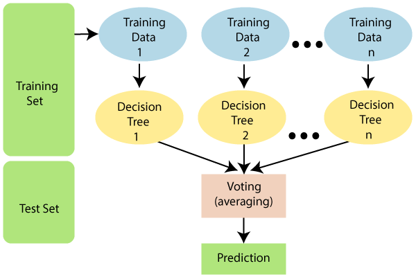

### **4. XGBoost**

The Python XGBoost package implements gradient-boosted decision trees with a focus on speed and execution, which is the most crucial component of ML (machine learning). Gradient Boosting is an AI technique that is used, among other things, in classification and regression assignments. It presents a forecast model as a group of weak decision trees for forecasting.

#### Functioning of XGBoost:

- The loss function must be improved, which means making it smaller than the outcome.
- Weak learners get used in the model to set expectations.
- In this, decision trees are used in a manner, which refers to choosing the best-divided targets in light of Gini Impurity and other factors or to restrict the loss function.
- The loss function is constrained by combining all of the weak models using the additive model.
- Each tree is added, making sure that no already existing trees in the decision tree are modified. The ideal hyper bounds are regularly discovered using the angle plummet procedure, after which more loads are refreshed.

### **5. Support Vector Machines**

One of the most well-liked supervised learning algorithms, Support Vector Machine, or SVM, is used to solve Classification and Regression problems. However, it is primarily employed in Machine Learning Classification problems.

The SVM algorithm's objective is to establish the optimal line or decision boundary that divides n-dimensional space into classes, allowing us to quickly classify fresh data points in the future. A hyperplane is the name given to this optimal decision boundary.

SVM selects the extreme vectors and points which help in the creation of the hyperplane. Support vectors, which are used to represent these extreme instances, form the basis for the SVM method.


There are two types of SVM:

- **Linear SVM**: Linear SVM is applied for data that can be divided into two classes using a single straight line. This type of data is called linearly separable data, and the classifier employed is known as a Linear SVM classifier.
- **Non-linear SVM**: Non-Linear SVM is a method of classification for non-linearly separated data. If a dataset cannot be categorised using a straight line, it is considered non-linear data, and the classifier employed is referred to as a Non-linear SVM classifier.

### **6. Convolutional Neural Networks**

One of the primary categories used in neural networks for image recognition and classification is the convolutional neural network.

CNN accepts an image as input and categorises and processes it using terms like "dog," "cat," "lion," "tiger," etc. The resolution of the image affects how the computer interprets it as an array of pixels. It will perceive as h \* w \* d, where h = height, w = width, and d = dimension, depending on the image resolution. For instance, a grayscale image is a matrix array of 4 \* 4 \* 1, while an RGB image is a matrix array of 6 \* 6 \* 3.

Each input image in CNN is processed by a series of convolutional layers, pooling layers, fully connected layers, and filters (sometimes referred to as kernels). The first layer to extract features from an input image is the convolution layer. The convolutional layer maintains the link between pixels by learning visual properties using a tiny square of input data. Using an image matrix and a kernel or filter as two inputs, it performs a mathematical action. By adding filters, the convolution of an image can perform an operation such as blur, sharpen, and edge detection.

The pooling layer is crucial to the pre-processing of a picture. When the photos are too big, the pooling layer minimises the number of parameters. "Downscaling" the picture acquired from the prior layers is pooling. It is comparable to reducing the size of an image to lessen its pixel density. Downsampling or subsampling are other terms for spatial pooling, which minimises the dimensionality of each map while keeping the crucial data. The input from the other levels will be flattened into a vector and transmitted to the fully connected layer. The output will be changed by the network into the desired number of classes.

The input from the other levels will be flattened into a vector and transmitted to the fully linked layer. The output will be changed by the network into the desired number of classes. To categorise the outputs as a vehicle, dog, truck, etc., the characteristics to build a model will be aggregated and then an activation function, such as softmax or sigmoid will be applied.


#### In this project, a simple CNN network was used to predict the outcome for two diseases.

**The summary of the model for predicting Alzheimer's is:**

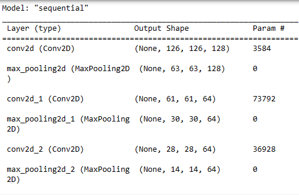

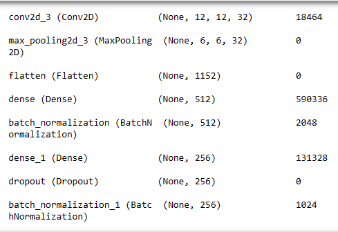

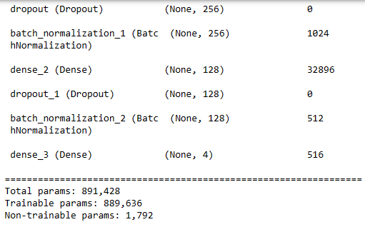

**The summary of the model used to predict the outcome of Kidney disorder is:**

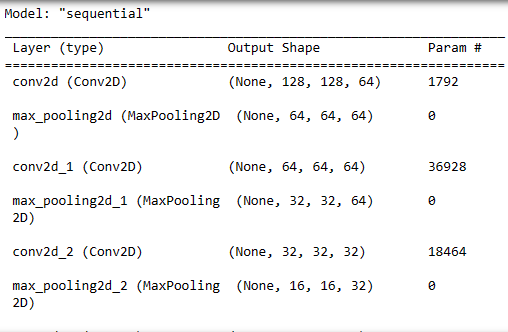

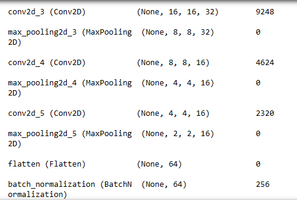

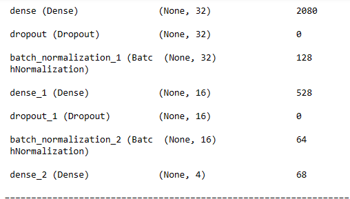

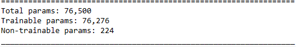


## **7. Transfer Learning Models**

Transfer learning is a machine learning research subject that is concerned with the storage of information obtained while resolving one problem and its subsequent application to another, related problem. Transfer learning is the ability to retain the knowledge gained from addressing one problem and apply it to a different one later on. With transfer learning, models are created utilising prior knowledge that demonstrates greater effectiveness and learns more quickly with less training data. The nicest thing about transfer learning is that just a portion of the trained model has to be learned in order to use it. Transfer learning helps us do this while saving time.

### **DenseNet201**

The Dense Convolutional Network (DenseNet) feeds forward connections between every layer. They reduce the number of parameters significantly, enhance feature propagation, increase feature reuse, and solve the vanishing-gradient problem.

> DenseNet is based on the premise that convolutional networks may be trained to be significantly deeper, more precise, and more effective if the connections between the layers near the input and the layers near the output are shorter. DenseNet-201 is 201 layers deep. The ImageNet database contains a pretrained version of the network that has been trained on more than a million images. The pretrained network can categorise photos into 1000 different item categories, including several animals, a keyboard, a mouse, and a pencil.
>
> DenseNet201 was used to predict the outcome for disease Pneumonia. The summary is given below:
>
> 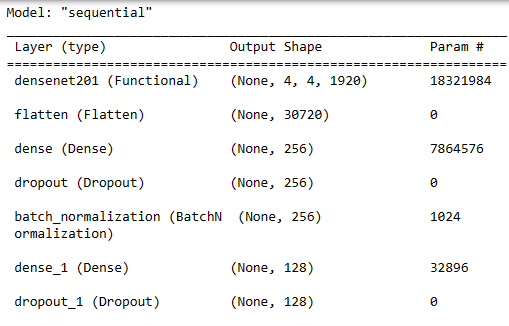
>
> 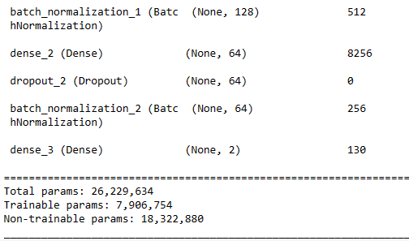

### **ResNet152V2**

Residual Neural Network (ResNet152V2) is a convolutional neural network with 152 layers in it. ResNet employs skip connections to fit the output from one layer to the next in order to address the issue of disappearing gradients. There are numerous convolutional layers and max pooling layers in this pretrained model.

> ResNet152V2 was used to predict the outcome of COVID-19. The summary of the model is:
>
> 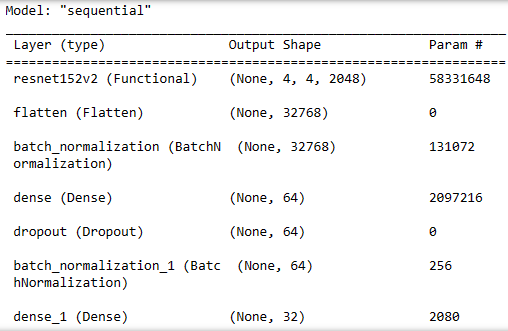
>
> 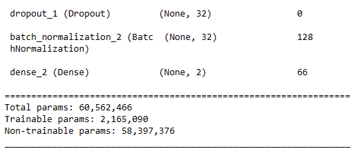

### **VGG19**

The Visual Geometry Group (VGG) at the University of Oxford created the convolutional neural network architecture known as VGG19. It is a deep learning model with 19 layers, 16 of which are convolutional and 3 of which are fully connected.

> The over-a-million-image ImageNet dataset served as the training set for VGG19, which is a model for image classification tasks. Small (3x3) convolutional filters are used across the whole network to create the architecture, which results in a highly deep but uniformly basic and straightforward design. Following the convolutional layers are the max-pooling layers, which lower the feature maps' spatial resolution and boost their translational resilience.
>
> To detect Brain Tumour VGG19 was used.
>
> 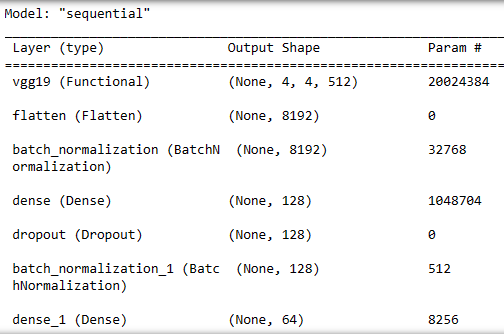
>
> 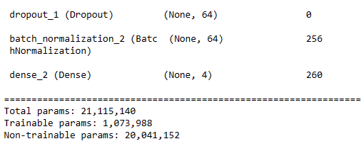

These algorithms were used to make the appropriate predictions for the diseases.

## **Experimentation Setup and Results** <a name="Exp"></a>

Using HTML, Bootstrap, and Flask, eight webpages were created for the diseases. Bootstrap offers a selection of JavaScript, CSS, and HTML building blocks that may be used to create web interfaces. Python-based Flask is a compact and adaptable web framework. It is made to be straightforward, simple to use, and offers the necessities for web development. Flask is adaptable and compatible with multiple hosting settings since it adheres to the WSGI (Web Server Gateway Interface) protocol and may operate on different web servers.

Also, a sqlite3 database is added to store the information of the user.

### **A. Tools Used:**

- **IDE:** Vscode, Jupyter Notebook
- **Platform:** Anaconda
- **Browser:** Microsoft Edge, Google browser (Tested On)
- **Languages:** Python 3.9, HTML, CSS
- **Framework:** Bootstrap v5.3.0-alpha, Tensorflow 2.9, Keras, Flask
- **Database:** sqlite3
- **Libraries:**
  1. numpy
  2. pandas
  3. scikit-learn
  4. matplotlib
  5. os
  6. scipy
  7. seaborn
  8. xgboost
  9. joblib
  10. pickle

### **B. Datasets and Sources:**

1. **For Alzheimer's:** Augmented Alzheimer MRI Dataset V2 <https://www.kaggle.com/datasets/uraninjo/augmented-alzheimer-mri-dataset-v2>
2. **For Brain Tumor:** Brain Tumor MRI Dataset <https://www.kaggle.com/datasets/masoudnickparvar/brain-tumor-mri-dataset>
3. **For Breast Cancer:** Breast Cancer Prediction Dataset <https://www.kaggle.com/datasets/merishnasuwal/breast-cancer-prediction-dataset>
4. **For Covid-19:** COVID 19 XRay and CT Scan Image <https://www.kaggle.com/datasets/ssarkar445/covid-19-xray-and-ct-scan-image-dataset>
5. **For Diabetes:** Diabetes prediction dataset <https://www.kaggle.com/datasets/iammustafatz/diabetes-prediction-dataset?resource=download>
6. **For Hepatitis C:** Hepatitis C Prediction Dataset <https://www.kaggle.com/datasets/fedesoriano/hepatitis-c-dataset>
7. **For Kidney Disease:** CT KIDNEY DATASET: Normal-Cyst-Tumor and Stone <https://www.kaggle.com/datasets/nazmul0087/ct-kidney-dataset-normal-cyst-tumor-and-stone>
8. **For Pneumonia:** Chest X-Ray Images (Pneumonia) <https://www.kaggle.com/datasets/paultimothymooney/chest-xray-pneumonia>

### **C. Features of Project**

1. Home page with Register/Log-in.
2. Individual pages for each of the 8 diseases. The user can input the symptoms and get the result as required.
3. On these pages, there is an option to save one's data. This data will then be stored in the database.
4. The result report will be displayed on the output page.
5. About Us page -- where information is provided about this system.
6. Contact Us page -- To send queries.

### **D. Directory Tree**

**DeepCareX - (ROOT)**

1. **Datasets** -- Consists of 8 datasets of diseases.
2. **Model_Code** -- Python codes for model generation of 8 diseases.
3. **Models** -- Saved deep learning and machine learning models in '.hdf', '.h5', and '.pkl' format.
4. **The frontend of the project consists of:**
   - **database:**
     1. Consists of a python script to create databases and its table.
     2. Consists of the sqlite3 database.
     3. A folder named "Uploaded" which saves all the images uploaded via frontend.
   - **static:**
     1. Images: consists of images which have been used for the frontend design.
     2. bootstrap-5.3.0-alpha3-dist: Installed bootstrap.
     3. bootstrap-icons-1.10.5: Installed bootstrap icon.
     4. jquery: consists of jquery-3.6.4.min.js script.
     5. popper: consists of popper.min.js.
   - **templates:** Consists of all the HTML files for frontend.
   - **main.py:** It's the main python script to run the application, designed using the Flask framework.


### **E. Instructions to Run:**

#### Run The Application:

1. **Create the databases:**
   - Navigate to: `DeepCareX/Website/database`
   - Run: `database.py`
   - Syntax: `python3 database.py`

2. **Run The Application:**
   - Navigate to: `DeepCareX/Website`
   - Run: `main.py`
   - Syntax: `python3 main.py`


### The algorithms gave us good results. We will now go through the evaluation metrics obtained for each disease.

### I. **Breast Cancer**

> The Random Forest algorithm was used to determine if a person had breast cancer. GridSearchCV was used to determine the best number of estimators and depth for the model. Using this, we chose max depth as 90 and the number of estimators as 500. The metrics used to evaluate the model's performance were Precision, Recall, F1 score, and Accuracy. The model gave a validation accuracy of 0.94, precision score of 0.94, recall of 0.94, and f1 score of 0.94.
>
> The training evaluation metrics are:
>
> 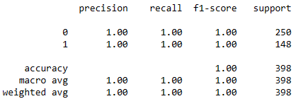
>
> The validation metrics are as follows:
>
> 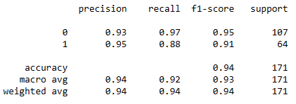

### II. **Diabetes**

> XGBoost Classifier was used to predict if a user had Diabetes. The model gave a validation accuracy of 0.97. Precision, recall, and f1 score were also 0.97.
>
> The evaluation metrics on training data were:
>
> 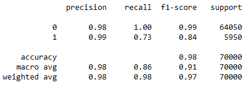
>
> The validation metrics observed are:
>
> 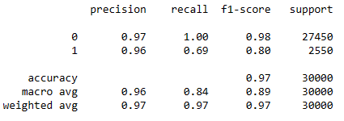

### III. **Hepatitis C**

> Hepatitis C was also predicted using XGBoost Classifier. The training metrics of the model observed are:
>
> 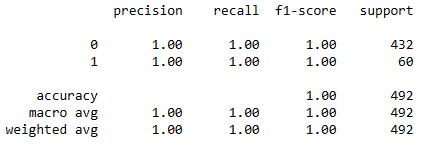
>
> The validation metrics are:
>
> 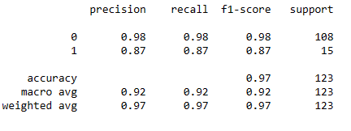

### IV. **Brain Tumour**

> Here VGG19 was used. The model gave a training accuracy of 0.98 and validation accuracy of 0.97.
>
> The graphical representation of change in accuracy and loss with the epochs is given below.
>
> 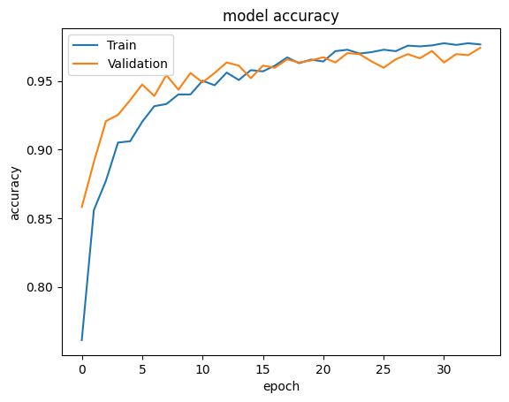
>
> 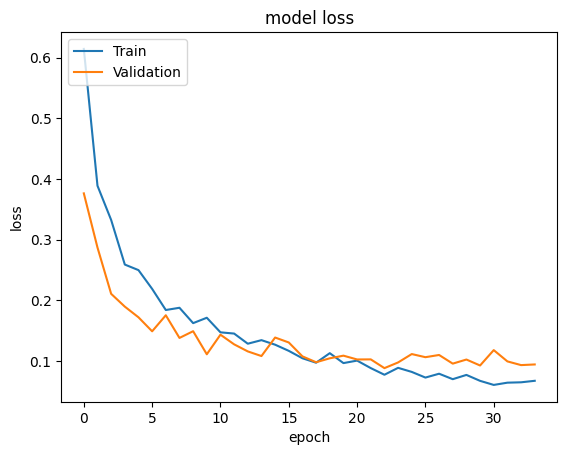

### V. **COVID-19**

> ResNet152V2 was used to determine COVID-19. The model gave a training accuracy of 0.98 and validation accuracy of 0.95.
>
> The accuracy plot and loss plot are given below:
>
> 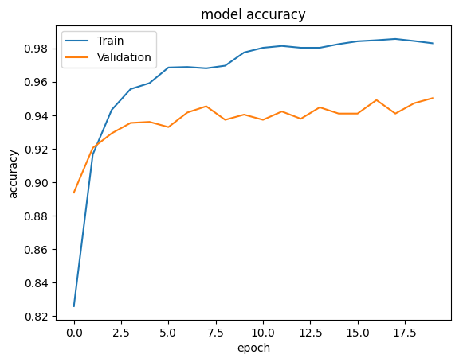
>
> 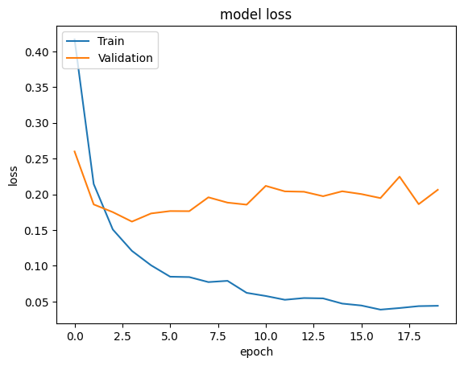

### VI. **Alzheimer's**

> To predict Alzheimer's, a Vanilla CNN network was created, the summary of which is mentioned in the Convolution Neural Network section.
>
> The model gave a training accuracy of 0.97 and validation accuracy of 0.98.
>
> The accuracy and loss are illustrated below:
>
> 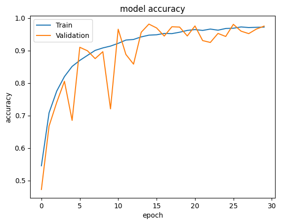
>
> 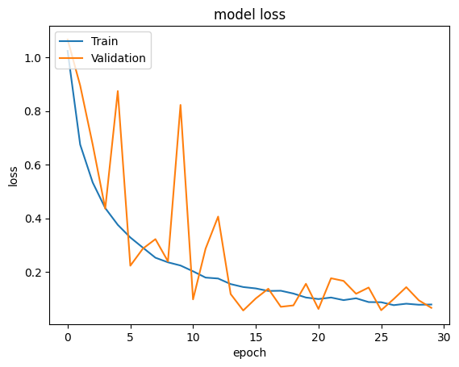

### VII. **Kidney Disorder**

> To predict kidney disorder, a CNN network was created. The model gave a 0.99 training accuracy and 0.97 validation accuracy.
>
> The accuracy and loss graphs are:
>
> 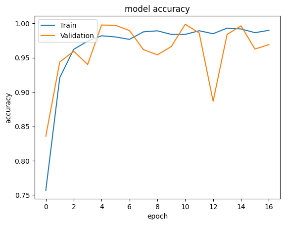
>
> 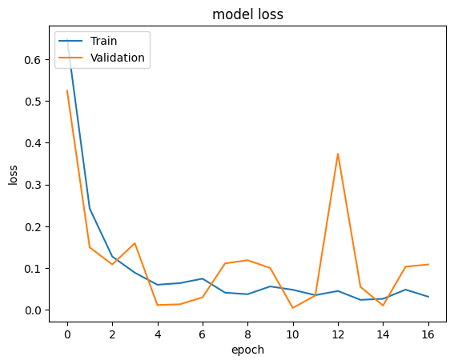

### VIII. **Pneumonia**

> DenseNet201 was used here and it gave a training accuracy of 0.98 and validation accuracy of 0.83. The accuracy and loss illustrations are given below:
>
> 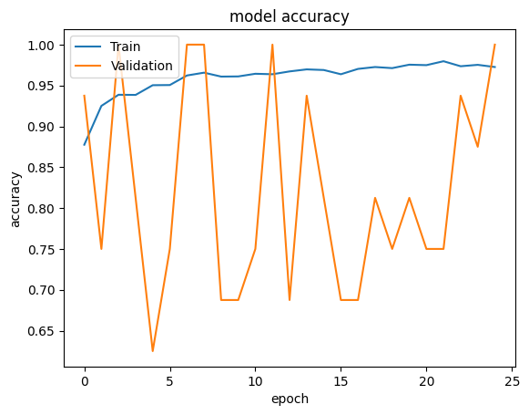
>
> 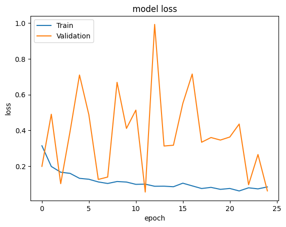


## **Use Cases** <a name="cases"></a>

The employment of these technologies can produce quick results within minutes, although real-life diagnosis might frequently take hours or even days. When given a set of symptoms, a trained model can quickly process and analyse the data, utilising its capacity to identify intricate patterns and make predictions based on learnt patterns from enormous amounts of data.

Machine and deep learning-based diagnostics' time-saving feature is especially helpful in emergency situations, where prompt decision-making is essential for giving prompt treatment. The possibility of saving lives and reducing the danger of illness development is increased by rapid diagnosis, which enables prompt therapies.

Additionally, the capacity to store symptom information and associated diagnoses from various individuals might be extremely beneficial for research. By combining this data, it is possible to analyse patterns and trends on a broader scale and find correlations, risk factors, and fresh perspectives on various diseases. These datasets can be used by researchers to increase understanding, create more precise models, and boost medical research and healthcare procedures.

## **System Requirements** <a name="requirements"></a>

### 1) Core runtime for the original Flask application

- **Python:** 3.10 to 3.12 recommended  
  (TensorFlow support is version-sensitive; Python 3.13 is not recommended for this stack)
- **Pip packages (minimum):**
  - `flask`
  - `tensorflow`
  - `numpy`
  - `pandas`
  - `scikit-learn`
  - `xgboost`
  - `matplotlib`
  - `seaborn`
  - `joblib`
  - `pickle` (standard library, no pip install required)
  - `sqlite3` (standard library, no pip install required)
- **OS:** Windows/Linux/macOS
- **Storage:** Sufficient free space for datasets and model files (`.pkl`, `.h5`, `.hdf5`)

### 2) Optional modern frontend (`deepcarex-web`)

- **Node.js:** v18+ (v20+ preferred)
- **npm:** v9+
- Install dependencies with `npm install`
- Run with `npm run dev` (Vite)

### 3) Data and model artifacts required

- Pre-trained model files under `Models/`
- Uploaded image input directory under `DeepCareX-Website/database/Uploaded`
- SQLite database file generated in `DeepCareX-Website/database/DeepCareX.db`

## **How It Works (End-to-End)** <a name="workflow"></a>

DeepCareX combines classical ML and deep learning models to handle both **tabular symptom data** and **medical image data**.

### Step 1: User provides input

- **Tabular diseases** (for example, diabetes, hepatitis, breast cancer): user submits form values such as age, history, blood metrics, and risk indicators.
- **Image-based diseases** (for example, brain tumor, Alzheimer's, kidney, pneumonia, COVID-19): user uploads an image (MRI/CT/X-ray), plus basic demographic metadata in the form.

### Step 2: Request handling in Flask

- Routing and form processing are handled in `DeepCareX-Website/main.py`.
- For image tasks:
  - The file is saved securely in `database/Uploaded`.
  - The image is resized and preprocessed.
  - The selected deep model (`.h5`/`.hdf5`) is loaded and used for inference.
- For tabular tasks:
  - Input is transformed according to model expectations.
  - Pre-trained ML estimators (`.pkl`) generate class prediction.

### Step 3: Model inference and confidence

- The model returns a target class and confidence/probability score.
- The application maps numeric classes to human-readable diagnosis labels.
- Output format is disease-specific (for example, `Kidney Stone (xx.xx%)`, `Normal (xx.xx%)`, etc.).

### Step 4: Optional persistence

- If the "save" option is enabled in the form, patient metadata and prediction are inserted into SQLite tables:
  - `USER`
  - `CONTACT`
  - `NEWSLETTER`
  - `PATIENTS`

### Step 5: Result generation

- The backend renders a result template with:
  - patient identifiers (name/id/age/gender)
  - disease type
  - predicted outcome with confidence
- This creates a complete input -> inference -> report flow.

## **Sample Input to Result Flow** <a name="sample-flow"></a>

This section clarifies how image input (like the brain MRI and kidney CT examples) is processed from upload to output.

### A) Brain MRI-type sample

1. User uploads a brain MRI slice image through the disease form.
2. Backend saves the file and normalizes image dimensions for the corresponding CNN/VGG-based model.
3. Model predicts one of the target classes (for the selected disease module).
4. App returns class label and confidence score in the report page.

### B) Kidney CT-type sample

1. User uploads a kidney CT image.
2. The kidney CNN model classifies into one of the supported classes:
   - Kidney Cyst
   - Normal
   - Kidney Stone
   - Kidney Tumor
3. Result is shown as a formatted diagnosis string with confidence percentage.

### Notes on interpretation

- Predictions are **decision-support outputs**, not a clinical final diagnosis.
- Confidence score reflects model certainty on trained distributions, not guaranteed real-world correctness.
- Better image quality and correct modality (MRI/CT/X-ray as expected by each model) improves reliability.

## **Updated Installation and Execution (Local)** <a name="install"></a>

Build and run on a local system:

1. Clone the repository:
```sh
git clone --recurse-submodules -j8 https://github.com/sumony2j/DeepCareX.git
cd DeepCareX
```

2. Create and activate a virtual environment (recommended):
```sh
python -m venv .venv
# Windows
.venv\Scripts\activate
# Linux/macOS
source .venv/bin/activate
```

3. Install dependencies:
```sh
pip install flask tensorflow numpy pandas scikit-learn matplotlib scipy seaborn xgboost joblib
```

4. Initialize database:
```sh
cd DeepCareX-Website/database
python database.py
```

5. Run backend website:
```sh
cd ..
python main.py
```
Open: `http://localhost:5000`

6. (Optional) Run React frontend:
```sh
cd ../deepcarex-web
npm install
npm run dev
```
Open: `http://localhost:5173`


## **Conclusion** <a name="con"></a>

With the use of machine learning models, which are employed in the project to forecast the disease based on input provided by the user as a content of symptoms which are picked from a specified list of symptoms provided to the user, the predicted outcome is presented. The projected consequence observed will also have a user interface (UI), making it simpler for a user to operate and forecast the disease based on information given and making the process easier to complete.

In conclusion, using machine learning and deep learning methods for illness prediction has demonstrated enormous potential for enhancing patient outcomes. These algorithms may accurately detect early indicators and forecast the chance of acquiring particular diseases through the analysis of vast datasets and the extraction of relevant patterns.

Researchers and medical professionals have been able to predict diseases with great accuracy by using machine learning algorithms like decision trees, random forests, support vector machines, and convolutional neural networks (CNNs). To produce insightful analyses and individualised forecasts, these models may analyse a variety of data types, including medical records, genetic data, lifestyle factors, and environmental data.

Using deep learning and machine learning to forecast diseases has several advantages. The first benefit is that it makes it possible for preventive healthcare interventions, allowing for early diagnosis and treatment, possibly improving patient outcomes, and lowering healthcare expenditures. Identifying high-risk people or communities also helps with resource allocation by enabling focused treatments and preventative actions.

It's crucial to remember that illness prediction models have some drawbacks. They rely significantly on the representativeness and quality of the training data, which can create biases and affect prediction accuracy. Furthermore, these models might be difficult to interpret, making it tough for medical experts to comprehend the logic behind a given forecast.

## **Future Work**

There is a lot of room for improvement and growth with this project. The system may be made even more complete and beneficial for users by adding further functions. Here are some ideas about how to make the project better:

### **Expanded Disease Database**

You can think about growing the illness database to offer a more comprehensive diagnosing capability. To cover a wider variety of medical issues, do more research and add more disorders. Users will be able to get early diagnosis and intervention for a variety of health concerns because of this.

### **Integration with Healthcare Professionals**

It would be really helpful to implement a function that links users with nearby medical professionals or consultants who are experts in the ailment that has been identified. The technology can enable smooth communication and appointments with healthcare providers by using location-based services and collaborating with physicians and hospitals. Users would obtain prompt and individualised medical care because of this connectivity.

### **Advanced Predictive Models**

It is critical to continuously enhance the machine learning models used for illness prediction. Investigate more cutting-edge algorithms and methods, such as ensemble models, deep learning, or reinforcement learning, to create prediction models that are more reliable and precise. As a result, the system's diagnoses will be more accurate and reliable, improving user effectiveness.

### **Complete Diagnostic Reports**

Consider adding extra output or report sections to provide consumers more in-depth information about the diagnosis rather than just offering simple result labels. Include further information, such as the causes of the diagnosis, danger factors, suggested cures, and safety precautions. Users will have more knowledge of their health issues as a result, which will help them take the right steps.

### **Accessibility and User-Friendly Design**

Ensure that the application's interface is simple and easy to use. To reach a larger user base, make sure the system is usable on a variety of platforms and devices, including mobile ones. Include elements like custom user profiles, monitoring of medical history, and alerts for scheduled appointments or medicines.

### **Data Security and Privacy**

Give data privacy and security top priority because the project will be working with sensitive health information. Implement strong security measures, maintaining data protection laws, and following confidentiality requirements to secure user data.

The project can develop into a complete and trustworthy health prediction and diagnosis system by putting these improvements into place. Users will be given the information they need to make wise decisions about their health, it will link them together with qualified healthcare professionals, and it will help with illness early detection and prevention.


## **Project Presentation** <a name="ppt"></a>

You can view the project presentation here:

[Project Presentation PDF](./DeepCareX.pdf)

## **Docker Deployment** <a name=docker></a>

### Prerequisites

Ensure you have Docker installed. You can download and install Docker from [here](https://docs.docker.com/get-docker/).

### Building the Docker Image

1. Clone the repository:

   ```bash
   git clone --recurse-submodules -j8 https://github.com/sumony2j/DeepCareX.git
   ```
2. Navigate to the project directory:

   ```bash
   cd DeepCareX
   ```
3. Build the Docker image:

   ```bash
   docker build -t deepcarex .
   ```
4. Start the container: (Port 5000 on your host machine is mapped to port 5000 of the container as the application is running on port 5000 of the container)

   ```bash
   docker run -it -d -p 5000:5000 deepcarex
   ```
5. Access the application:

   ```bash
   Open your web browser and go to http://localhost:5000
   ```

### Use Docker image from DockerHub

1. Pull the docker builtin image

   ```bash
   docker pull sumon2j/deepcarex:latest
   ```
2. Start the container: (Port 5000 on your host machine is mapped to port 5000 of the container as the application is running on port 5000 of the container)

   ```bash
   docker run -it -d -p 5000:5000 deepcarex:latest
   ```
3. Access the application:

   ```bash
   Open your web browser and go to http://localhost:5000
   ```

##  Contributing <a name="contri"></a>

Contributions are welcome! Here are several ways you can contribute:

- **[Report Issues](https://github.com/sumony2j/DeepCareX.git/issues)**: Submit bugs found or log feature requests for the `DeepCareX.git` project.
- **[Submit Pull Requests](https://github.com/sumony2j/DeepCareX.git/blob/main/CONTRIBUTING.md)**: Review open PRs, and submit your own PRs.
- **[Join the Discussions](https://github.com/sumony2j/DeepCareX.git/discussions)**: Share your insights, provide feedback, or ask questions.

<details closed>
   
<summary>Contributing Guidelines</summary>

1. **Fork the Repository**: Start by forking the project repository to your github account.
2. **Clone Locally**: Clone the forked repository to your local machine using a git client.
   ```sh
   git clone https://github.com/sumony2j/DeepCareX.git
   ```
3. **Create a New Branch**: Always work on a new branch, giving it a descriptive name.
   ```sh
   git checkout -b new-feature-x
   ```
4. **Make Your Changes**: Develop and test your changes locally.
5. **Commit Your Changes**: Commit with a clear message describing your updates.
   ```sh
   git commit -m 'Implemented new feature x.'
   ```
6. **Push to github**: Push the changes to your forked repository.
   ```sh
   git push origin new-feature-x
   ```
7. **Submit a Pull Request**: Create a PR against the original project repository. Clearly describe the changes and their motivations.
8. **Review**: Once your PR is reviewed and approved, it will be merged into the main branch. Congratulations on your contribution!
</details>

